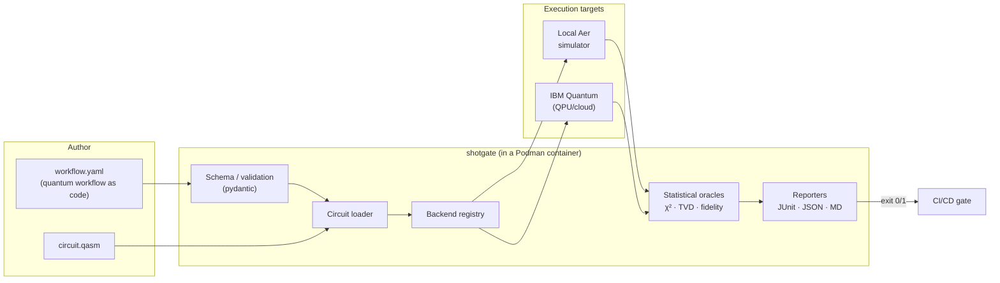

<div align="center">


# shotgate

**Container-native CI/CD quality gates for quantum circuits.**

*Statistically validate the probabilistic output of quantum programs across simulators and real quantum processing units (QPUs), defined as code.*

[](https://github.com/coldqubit/shotgate/actions/workflows/ci.yml)
[](LICENSE)
[](pyproject.toml)
[](#roadmap)

<br/>


<sub>Representative output of <code>shotgate run examples/bell-state/workflow.yaml</code>.</sub>

</div>

---

## Why shotgate exists

Classical CI/CD relies on determinism: the same input gives the same output, so `assert x == y`
holds. Quantum programs break that assumption. Run the same circuit twice and the shot counts
differ, so a pipeline cannot gate on exact equality. The community has noted the same gap:

> "Unlike deterministic classical programs, quantum algorithms often produce probabilistic
> results, requiring specialized validation and error mitigation strategies in CI/CD
> pipelines." (DevOps community guidance)
>
> "Terraform modules and Helm charts may need support for quantum backends, simulators..."

The statistical oracles that handle probabilistic output are established in the literature
(QUTest, QuCheck, chi-square as oracle): chi-square goodness-of-fit (GoF), total variation
distance (TVD), and Hellinger fidelity. They live mostly in research prototypes rather than in
production DevOps tooling. shotgate packages them so a quantum circuit can be gated in an
ordinary pipeline. It:

1. Defines quantum test workflows as declarative YAML ("quantum workflow as code").
2. Executes circuits on simulators or real QPUs through a pluggable backend layer.
3. Validates the output distribution statistically and emits JUnit, JSON, and Markdown reports.
4. Returns exit code 0 on pass and 1 on failure, so it drops into a CI quality gate directly.
5. Ships an Infrastructure-as-Code layer (Terraform) and isolation tiers (Podman, KVM/QEMU).

See [`docs/architecture.md`](docs/architecture.md) for the design and
[`docs/motivation.md`](docs/motivation.md) for the market and community analysis with sources.

## What it looks like

```yaml
# Trimmed from examples/bell-state/workflow.yaml
apiVersion: shotgate.dev/v1alpha1
kind: QuantumWorkflow
metadata:
  name: bell-state
defaults:
  backend: { provider: local-aer, shots: 8192, seed: 1234 }
jobs: [
  { name: bell-pair,
    circuit: { format: qasm2, path: bell.qasm },
    assertions: [
      { type: chi_square,       expected: { "00": 0.5, "11": 0.5 }, significance: 0.01 },
      { type: distribution_tvd, expected: { "00": 0.5, "11": 0.5 }, max_distance: 0.03 },
      { type: allowed_states,   states: ["00", "11"], max_leakage: 0.0 }
    ]
  }
]
```

```console
$ shotgate run examples/bell-state/workflow.yaml
─────────────────────────── shotgate :: bell-state ───────────────────────────
 job: bell-pair · aer_simulator · 8192 shots
 ┏━━━━━━━━━━━━━━━━━━━━━━━━━━━┳━━━━━━━━┳━━━━━━━━━━━━━━━━━━━━━━━━━━━━━━━━━━━━━━━━━━━┓
 ┃ Assertion                 ┃ Result ┃ Detail                                    ┃
 ┡━━━━━━━━━━━━━━━━━━━━━━━━━━━╇━━━━━━━━╇━━━━━━━━━━━━━━━━━━━━━━━━━━━━━━━━━━━━━━━━━━━┩
 │ chi-square p >= 0.01      │  PASS  │ chi-square=0.410 dof=1 p-value=0.5220     │
 │ TVD <= 0.03               │  PASS  │ total variation distance 0.0043 (<= 0.03) │
 │ fidelity >= 0.99          │  PASS  │ Hellinger fidelity 1.0000 (>= 0.99)       │
 │ leakage <= 0.0            │  PASS  │ support leakage 0.0000 (<= 0.0)           │
 │ P(00) >= 0.45 and <= 0.55 │  PASS  │ P(00) = 0.4957                            │
 └───────────────────────────┴────────┴───────────────────────────────────────────┘
 PASSED · 5/5 assertions · 0.214s
```

The same run drops into a pipeline through the Markdown reporter (`--markdown`), rendered
as a step summary or a PR comment:

> ## shotgate: `bell-state` (✅ passed)
>
> - Jobs: **1**, failed: **0**
> - Assertions: **5**, failed: **0**
> - Duration: **0.214s**
>
> | Job | Backend | Shots | Assertion | Result | Detail |
> | --- | --- | --- | --- | --- | --- |
> | `bell-pair` | aer_simulator | 8192 | chi-square p >= 0.01 | ✅ | chi-square=0.410 dof=1 p-value=0.5220 (>= alpha=0.01) |
> | `bell-pair` | aer_simulator | 8192 | TVD <= 0.03 | ✅ | total variation distance 0.0043 (<= 0.03) |
> | `bell-pair` | aer_simulator | 8192 | fidelity >= 0.99 | ✅ | Hellinger fidelity 1.0000 (>= 0.99) |
> | `bell-pair` | aer_simulator | 8192 | leakage <= 0.0 | ✅ | support leakage 0.0000 (<= 0.0) |
> | `bell-pair` | aer_simulator | 8192 | P(00) >= 0.45 and <= 0.55 | ✅ | P(00) = 0.4957 |

## Install and run

Two install paths are supported and produce identical validation results. Use the container
when you want a pinned, reproducible runtime with the simulator baked in; use the pip package
when you want the `shotgate` CLI or the pytest plugin inside an existing Python environment.

### Path A: Podman (pull and run)

Pull the published image and gate a workflow without installing anything into your host Python:

```bash
# --userns=keep-id --user maps you through the container's user namespace so the
# JUnit report is written back owned by you (the image runs as a non-root user).
podman run --rm --userns=keep-id --user "$(id -u):$(id -g)" \
  -v "$PWD:/work:Z" -w /work \
  ghcr.io/coldqubit/shotgate:latest \
  run examples/bell-state/workflow.yaml --junit report.xml
```

For the cloud/QPU path, use the IBM-enabled image variant and pass a token:

```bash
podman run --rm -e SHOTGATE_IBM_TOKEN \
  -v "$PWD:/work:Z" -w /work \
  ghcr.io/coldqubit/shotgate:latest-ibm \
  run examples/bell-state-hardware/workflow.yaml --backend ibm
```

The same images are mirrored to Docker Hub if you prefer it: swap the registry prefix for
`docker.io/coldqubit/shotgate` (tags `latest`, `latest-ibm`, and each version). GHCR is the
canonical registry; the Docker Hub copy is a convenience mirror.

### Path B: pip (CLI and pytest plugin)

Install the package with the backend extra you need (`aer` for the local simulator, `ibm` for
IBM Quantum). This installs the `shotgate` CLI and registers a pytest plugin:

```bash
pip install 'shotgate[aer]'
shotgate run examples/bell-state/workflow.yaml --junit report.xml
```

The pytest plugin turns each declared assertion into one pytest item. Point it at a workflow
with `--shotgate`, or rely on auto-collection of files named exactly `workflow.yaml`:

```bash
pytest --shotgate examples/bell-state/workflow.yaml
```

A workflow whose backend dependencies are absent skips with a reason naming the extra to
install, rather than erroring at import. The `shotgate_paths` ini key collects the same way
without a command-line flag.

Exit code 0 means all assertions passed, 1 means a gate failed, and 2 means a bad workflow or
usage error, so either path drops into a pipeline. The container is the default for this repo's
own development (see [Build from source](#build-from-source)) because the tests run against the
source tree.

### Build from source

```bash
make build         # podman build -t shotgate:dev .
make run WORKFLOW=examples/bell-state/workflow.yaml
make test          # full test suite in a container
```

For hardware-isolated runs (each pipeline in a throwaway KVM micro-VM), see
[`infra/qemu/`](infra/qemu/). For declarative provisioning, see the Terraform module in
[`infra/terraform/`](infra/terraform/).

## The assertion catalog

| Type | Oracle | Use it for |
| --- | --- | --- |
| `chi_square` | Pearson χ² GoF test (p-value vs α) | Formal hypothesis test; plain on simulators, hardware-capable via `readout_error: auto` |
| `distribution_tvd` | Total variation distance (TVD) ≤ bound | Default distribution check; interpretable, shot-count-agnostic |
| `hellinger_fidelity` | Classical fidelity ≥ threshold | Fidelity tracking against an ideal distribution |
| `state_probability` | Marginal P(state) in a window / ≈ target | Single-outcome amplitude checks (e.g. Grover) |
| `allowed_states` | Probability mass outside support ≤ budget | Structural/leakage guarantees (e.g. GHZ corners) |
| `kl_divergence` | KL D(obs‖exp) ≤ bound (bits) | Information-theoretic distance; **simulator-only** (zero-support) |
| `shannon_entropy` | Entropy in a min/max window (bits) | Assert the intended randomness/concentration |
| `expectation_value` | `<Z..Z>` in [-1, 1] via window / target | Correlation/parity observable tracking |
| `most_frequent_outcome` | Modal state (optional min probability) | Single intended answer (e.g. Grover) |
| `circuit_depth` | Authored-circuit depth in a window | Static complexity budget (no execution) |
| `gate_set` | Circuit uses only allowed gate names | Enforce a basis / catch unexpected gates (no execution) |

Full reference: [`docs/assertions.md`](docs/assertions.md). The statistical core is pure Python
(no SciPy), including a from-scratch χ² survival function via the regularised incomplete gamma
function. See [`src/shotgate/validation/metrics.py`](src/shotgate/validation/metrics.py).

## Architecture at a glance



The layers are decoupled: the validation core has no quantum-SDK dependency, so the metrics and
schema run anywhere, and heavy SDKs are imported lazily only when a backend is actually used.
The same artifact therefore runs in a small CI container and against a real QPU.

## Repository layout

```text
shotgate/
├── src/shotgate/          # the package (validation core, backends, runner, CLI, pytest plugin)
├── examples/              # runnable workflows: bell/ghz/grover + backend & oracle variants
├── tests/                 # unit tests (core) + integration tests (gated on aer)
├── infra/
│   ├── terraform/         # IaC module: "quantum workflow as code"
│   └── qemu/              # ephemeral KVM/QEMU runner (cloud-init)
├── docs/                  # architecture, pipeline schema, ADRs, specs, diagrams
├── .github/workflows/     # Podman-based CI + release
├── Containerfile          # the shotgate runtime image
└── Makefile               # Podman/QEMU task runner
```

## Backends

| Provider | Status |
| --- | --- |
| `local-aer` (Qiskit Aer simulator) | **Working**, default, baked into the image |
| `ibm` (IBM Quantum via Qiskit Runtime) | **Validated on real hardware** (`ibm_fez`, 2026-06-11: Bell/GHZ/Grover gates passed at 4096 shots; [measured baseline](docs/hardware-validation.md)) |
| `braket` (AWS Braket via qiskit-braket-provider) | **Working: local simulation** (no AWS account). Cloud devices need AWS credentials; not yet validated on real Braket hardware. |
| Error mitigation ([Mitiq](https://mitiq.readthedocs.io/)) | **Planned** |

## Roadmap

- **v0.1:** YAML workflows, local Aer backend, χ²/TVD/fidelity/structural oracles,
  JUnit/JSON/MD reporters, Podman and KVM/QEMU isolation, Terraform module, pytest plugin,
  PyPI package, published GHCR image with an IBM-enabled variant.
- **v0.2:** statistical gates **validated against real quantum hardware** (`ibm_fez`,
  2026-06-11, Bell/GHZ/Grover at 4096 shots; measured baseline and runbook in
  [`docs/hardware-validation.md`](docs/hardware-validation.md)), hardware example gates for
  GHZ and Grover, and a dispatchable QPU validation workflow.
- **v0.3.0:** the OpenQASM 3 fix and fail-closed validation, four more oracles
  (`kl_divergence`, `shannon_entropy`, `expectation_value`, `most_frequent_outcome`),
  declarative noise-model simulation and noise-aware expected distributions (so
  `chi_square`/`kl_divergence` can gate on hardware), and the AWS Braket backend (local
  simulation; the cloud path awaits validation on real hardware).
- **v0.4.0:** structural oracles `circuit_depth` and `gate_set`, static circuit-property
  gates that run with no execution (no shots, no QPU, no backend).
- **v0.5.0 (latest release):** `readout_error: auto` for `chi_square`/`kl_divergence`, which
  uses the run's actual readout calibration (the device's published numbers on a QPU, none on
  a noiseless simulator), so one workflow gates plain on a simulator and calibrated on
  hardware.
- **Planned**, each shipped as its own [SemVer](https://semver.org/) MINOR release: error
  mitigation via [Mitiq](https://mitiq.readthedocs.io/), multi-backend differential testing,
  circuit fixtures and property-based generation, a Helm chart, an optional OpenTelemetry
  exporter (kept out of the core dependencies), and validation of the Braket cloud path on
  real hardware. **`1.0.0`** is the API-stability milestone (the `shotgate.dev/v1` schema and
  a frozen CLI/Python surface), not a feature count.

See [`CHANGELOG.md`](CHANGELOG.md) and the [ADRs](docs/adr/) for decisions and rationale.

## Contributing and security

Contributions are welcome. Start with [`CONTRIBUTING.md`](CONTRIBUTING.md) and the
[`CODE_OF_CONDUCT.md`](CODE_OF_CONDUCT.md). Report vulnerabilities per [`SECURITY.md`](SECURITY.md).

## Maintainers

shotgate is an independent open-source project, developed in the open under the
[coldqubit](https://github.com/coldqubit) project home. It is maintained today by one
maintainer; co-maintainers and new contributors are welcome. See
[MAINTAINERS.md](MAINTAINERS.md) for the current roster and how to join it,
[GOVERNANCE.md](GOVERNANCE.md) for how decisions are made, and
[CONTRIBUTING.md](CONTRIBUTING.md) to get started.

## License

[Apache-2.0](LICENSE) © 2026 coldqubit.

shotgate is free and open source under the Apache License 2.0. You may use, modify, and
redistribute it for any purpose, including commercial and closed-source software, provided you
retain the license text and the copyright and attribution notices (Apache-2.0 sections 4(a)
through 4(d)).

> **Note on prior art:** the existing `coveooss/terraform-provider-quantum` is unrelated to
> quantum circuits; it manipulates JSON.
