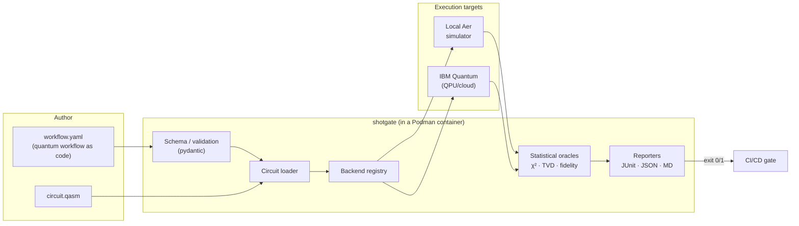

<div align="center">

# shotgate

**Container-native CI/CD quality gates for quantum circuits.**

*Statistically validate the probabilistic output of quantum programs — across simulators and real QPUs — defined entirely as code.*

[](.github/workflows/ci.yml)
[](LICENSE)
[](pyproject.toml)
[](#roadmap)

</div>

---

## Why shotgate exists

Classical CI/CD assumes determinism: same input, same output, `assert x == y`. **Quantum
programs break that assumption.** Run the same circuit twice and you get different shot
counts. You cannot gate a pipeline on exact equality, and the ecosystem reflects the gap:

> *"Unlike deterministic classical programs, quantum algorithms often produce probabilistic
> results, requiring specialized validation and error mitigation strategies in CI/CD
> pipelines."* — DevOps community guidance
>
> *"DevOps thrives on testing, but quantum computing lacks robust test frameworks."*

The *statistical* techniques to do this correctly — χ² goodness-of-fit, total variation
distance, Hellinger fidelity — are well established in the academic literature (QUTest,
QuCheck, χ²-as-oracle). **But they live in research prototypes, not in production DevOps
tooling.** Meanwhile, Infrastructure-as-Code can't describe quantum workloads:

> *"Terraform modules and Helm charts may need support for quantum backends, simulators…"*

**shotgate closes that gap.** It packages the proven statistical oracles into a single,
container-native CLI that:

1. Defines quantum test workflows **as declarative YAML** ("quantum workflow as code").
2. Executes circuits on **simulators or real QPUs** through a pluggable backend layer.
3. **Validates probabilistic output statistically** and emits JUnit/JSON/Markdown reports.
4. Returns a **non-zero exit code on failure** — a drop-in CI quality gate.
5. Ships an **IaC layer** (Terraform) and **VM/container isolation** (Podman + KVM/QEMU).

See [`docs/architecture.md`](docs/architecture.md) for the full design and
[`docs/motivation.md`](docs/motivation.md) for the market/community analysis (with sources) that motivated it.

## What it looks like

```yaml
# examples/bell-state/workflow.yaml
apiVersion: shotgate.dev/v1alpha1
kind: QuantumWorkflow
metadata:
  name: bell-state
defaults:
  backend: { provider: local-aer, shots: 8192, seed: 1234 }
jobs:
  - name: bell-pair
    circuit: { format: qasm2, path: bell.qasm }
    assertions:
      - type: chi_square                              # statistical goodness-of-fit
        expected: { "00": 0.5, "11": 0.5 }
        significance: 0.01
      - type: distribution_tvd                        # total variation distance bound
        expected: { "00": 0.5, "11": 0.5 }
        max_distance: 0.03
      - type: allowed_states                          # structural: no leakage
        states: ["00", "11"]
        max_leakage: 0.0
```

```console
$ shotgate run examples/bell-state/workflow.yaml
──────────────────────── shotgate :: bell-state ────────────────────────
 job: bell-pair · aer_simulator · 8192 shots
 ┏━━━━━━━━━━━━━━━━━━━━━┳━━━━━━━━┳━━━━━━━━━━━━━━━━━━━━━━━━━━━━━━━━━━━━━━┓
 ┃ Assertion           ┃ Result ┃ Detail                              ┃
 ┡━━━━━━━━━━━━━━━━━━━━━╇━━━━━━━━╇━━━━━━━━━━━━━━━━━━━━━━━━━━━━━━━━━━━━━━┩
 │ chi-square p >= 0.01│  PASS  │ chi-square=0.41 dof=1 p-value=0.52  │
 │ TVD <= 0.03         │  PASS  │ total variation distance 0.0043     │
 │ leakage <= 0.0      │  PASS  │ support leakage 0.0000              │
 └─────────────────────┴────────┴─────────────────────────────────────┘
 PASSED · 5/5 assertions · 0.214s
```

## Quickstart (no host installs — pull and run)

The primary path is to **pull the published image** and gate a workflow — nothing is
built locally and nothing touches your host Python:

```bash
# --userns=keep-id --user maps you through the container's user namespace so the
# JUnit report is written back owned by you (the image runs as a non-root user).
podman run --rm --userns=keep-id --user "$(id -u):$(id -g)" \
  -v "$PWD:/work:Z" -w /work \
  ghcr.io/coldqubit/shotgate:latest \
  run examples/bell-state/workflow.yaml --junit report.xml
```

Exit code `0` = all assertions passed, `1` = a gate failed, `2` = bad config — drop it
straight into any pipeline. For the **cloud/QPU path**, use the IBM-enabled variant and
pass a token:

```bash
podman run --rm -e SHOTGATE_IBM_TOKEN \
  -v "$PWD:/work:Z" -w /work \
  ghcr.io/coldqubit/shotgate:latest-ibm \
  run examples/bell-state-hardware/workflow.yaml --backend ibm
```

### Build from source (contributors / air-gapped runners)

```bash
make build         # podman build -t shotgate:dev .
make run WORKFLOW=examples/bell-state/workflow.yaml
make test          # full test suite in a container
```

For **hardware-isolated** runs (each pipeline in a throwaway KVM micro-VM), see
[`infra/qemu/`](infra/qemu/). For **declarative provisioning**, see the Terraform module in
[`infra/terraform/`](infra/terraform/).

## The assertion catalog

| Type | Oracle | Use it for |
| --- | --- | --- |
| `chi_square` | Pearson χ² goodness-of-fit (p-value vs α) | The rigorous statistical "does this match?" test |
| `distribution_tvd` | Total variation distance ≤ bound | Robust, shot-count-agnostic distribution check |
| `hellinger_fidelity` | Classical fidelity ≥ threshold | Fidelity tracking against an ideal distribution |
| `state_probability` | Marginal P(state) in a window / ≈ target | Single-outcome amplitude checks (e.g. Grover) |
| `allowed_states` | Probability mass outside support ≤ budget | Structural/leakage guarantees (e.g. GHZ corners) |

Full reference: [`docs/assertions.md`](docs/assertions.md). The statistical core is pure
Python (no SciPy) — including a from-scratch χ² survival function via the regularised
incomplete gamma function. See [`src/shotgate/validation/metrics.py`](src/shotgate/validation/metrics.py).

## Architecture at a glance



Layers are decoupled: the validation core has **no quantum-SDK dependency**, so metrics and
schema run anywhere; heavy SDKs are imported lazily only when a backend is actually used.
This is what lets the same artifact run in a 30 MB CI container and against a real QPU.

## Repository layout

```text
shotgate/
├── src/shotgate/            # the package (validation core, backends, runner, CLI)
├── examples/              # runnable workflows: bell, ghz, grover
├── tests/                 # unit tests (core) + integration tests (gated on aer)
├── infra/
│   ├── terraform/         # IaC module: "quantum workflow as code"
│   └── qemu/              # ephemeral KVM/QEMU runner (cloud-init)
├── docs/                  # architecture, pipeline schema, ADRs, specs, diagrams
├── .github/workflows/     # Podman-based CI + release
├── Containerfile          # the shotgate runtime image
└── Makefile               # Podman/QEMU wrappers — no host installs
```

## Backends

| Provider | Status |
| --- | --- |
| `local-aer` (Qiskit Aer simulator) | **Working**, default, baked into the image |
| `ibm` (IBM Quantum via Qiskit Runtime) | **Implemented, not yet validated on real hardware** — see [hardware validation plan](docs/hardware-validation.md) |
| `braket` (AWS Braket) | **Planned** (not selectable yet) |
| Error mitigation ([Mitiq](https://mitiq.readthedocs.io/)) | **Planned** |

## Roadmap

- **v0.1 (now):** YAML workflows, local Aer backend, χ²/TVD/fidelity/structural oracles,
  JUnit/JSON/MD reporters, Podman + KVM/QEMU isolation, Terraform module.
- **v0.2:** **Validate the statistical gates against real quantum hardware** (IBM Quantum
  first, via the hardened `ibm` backend — see [`docs/hardware-validation.md`](docs/hardware-validation.md));
  published GHCR image with an IBM-enabled variant; GitLab & Jenkins references;
  noise-model simulation; a minimal **AWS Braket** backend.
- **v0.3:** error mitigation via [Mitiq](https://mitiq.readthedocs.io/); circuit fixtures &
  property-based generation; multi-backend differential testing; Helm chart; **optional**
  OpenTelemetry exporter for the telemetry layer (kept out of the core dependencies).

See [`CHANGELOG.md`](CHANGELOG.md) and the [ADRs](docs/adr/) for decisions and rationale.

## Contributing & security

Contributions welcome — start with [`CONTRIBUTING.md`](CONTRIBUTING.md) and the
[`CODE_OF_CONDUCT.md`](CODE_OF_CONDUCT.md). Report vulnerabilities per [`SECURITY.md`](SECURITY.md).

## Maintainer

Built and maintained by **[coldqubit](https://github.com/coldqubit)** — an independent
quantum-projects organization ([@morph-eos](https://github.com/morph-eos)). shotgate is the
name of this project; *coldqubit* is who builds it.

## License

[GNU AGPL-3.0-or-later](LICENSE) © coldqubit.

shotgate is free and open source. The AGPL's network-copyleft is deliberate: anyone
who distributes shotgate **or runs a modified version as a hosted/SaaS service** must
release their source under the same license. You may use it freely (including
commercially) — you may not make it closed-source.

> **Note on prior art:** the existing `coveooss/terraform-provider-quantum` is unrelated to
> quantum circuits (it manipulates JSON). shotgate is, to our knowledge, the first maintained,
> container-native attempt to bring statistical quantum-circuit validation into mainstream
> CI/CD and IaC workflows.
