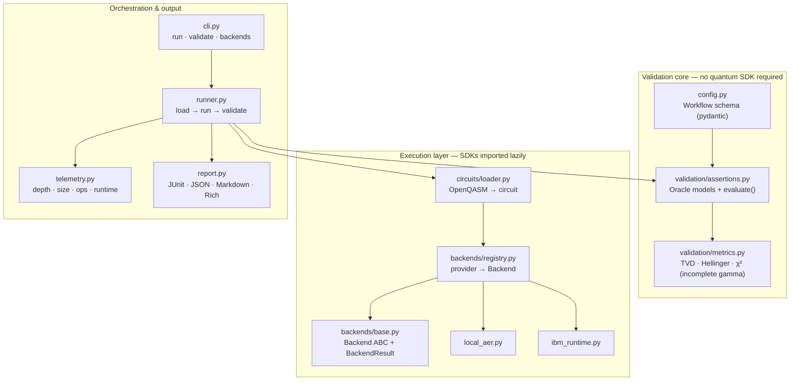
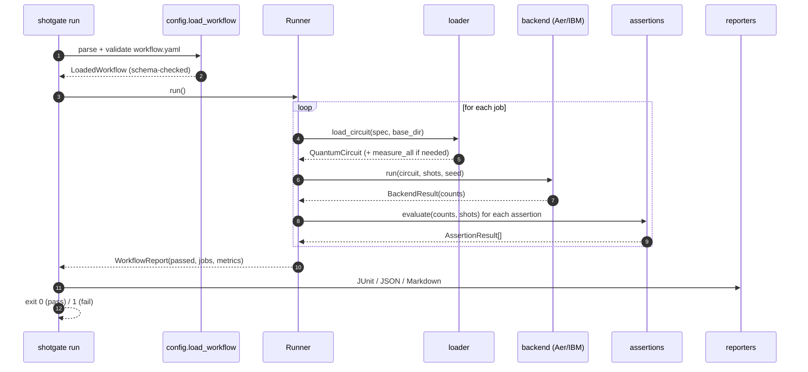
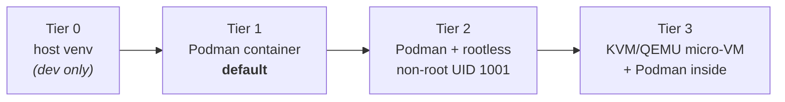

# Solution Architecture

> Status: `v0.1` (alpha). This document describes the design, its rationale, and
> the extension points that keep shotgate "minimal but scalable".

## 1. Problem statement

Quantum programs are probabilistic. The same circuit, executed twice, returns
different shot counts. Classical CI/CD — built on deterministic equality — has no
native way to gate on this. Three concrete gaps follow:

1. **No statistical quality gate.** Teams hand-roll ad-hoc `assert counts["00"] > N`
   checks that are either flaky or meaningless.
2. **No "workflow as code".** There is no declarative, reviewable artifact that says
   *"this circuit, on this backend, must satisfy these statistical properties"*.
3. **No IaC / isolation story.** Terraform/Helm can't describe quantum workloads, and
   running untrusted circuits in CI lacks an isolation model.

shotgate addresses all three with one composable tool.

## 2. Design principles

| Principle | Consequence in the codebase |
| --- | --- |
| **Statistically correct by construction** | Oracles are χ², TVD, Hellinger fidelity — not equality. The χ² survival function is implemented from first principles ([`metrics.py`](../src/shotgate/validation/metrics.py)). |
| **Core is dependency-light** | The validation core imports only the standard library + pydantic. No quantum SDK is needed to parse a workflow or compute a metric. |
| **Backends are lazy & pluggable** | Heavy SDKs (qiskit, braket) are imported only when a backend actually runs. New providers register a `"module:Class"` string. |
| **Everything runs in a container** | The unit of execution is the shotgate image. The host needs only Podman (and optionally QEMU). |
| **Declarative over imperative** | Workflows are strict YAML (`extra="forbid"`); typos fail fast. Circuits are OpenQASM, not executable Python. |
| **CI-native output** | JUnit XML, JSON, and Markdown are first-class; exit codes gate pipelines. |

## 3. Component model

**Dependency direction is strictly downward.** `report` and `runner` depend on the
core; the core never imports the execution layer. This is what lets the same wheel
run a 30 MB metrics-only container and a full QPU job.

## 4. Execution data flow

Failures are isolated **per job**: a missing dependency, an unparsable circuit, or a
failed assertion is captured in that job's report and never aborts the others.

## 5. Isolation tiers

shotgate offers escalating isolation, all without polluting the host:

| Tier | Mechanism | Use when |
| --- | --- | --- |
| 1 | `podman run shotgate` | Normal CI gating. |
| 2 | Rootless Podman, non-root image user | Shared/hardened CI runners. |
| 3 | Ephemeral Fedora micro-VM (`infra/qemu`) | Untrusted circuits; VM-grade stage isolation. |

See [ADR-0003](adr/0003-container-and-vm-isolation.md).

## 6. Security model

- **No executable circuits.** Circuits are OpenQASM, parsed by qiskit's QASM reader —
  not `eval`'d Python.
- **Strict schema.** Unknown fields are rejected, preventing silent misconfiguration.
- **Secrets never touch disk.** Cloud tokens come from env vars / container `-e`; the
  Terraform module marks them `sensitive`.
- **Least privilege.** The runtime image runs as a non-root user; the VM tier adds a
  hardware boundary.

## 7. Extension points (how it scales)

| To add… | Do this | Touches the core? |
| --- | --- | --- |
| A new **assertion oracle** | Add a pydantic model with a unique `type` literal + `evaluate()`, append to the `Assertion` union and `ASSERTION_TYPES` | No core math beyond a new `metrics` fn |
| A new **backend** | Implement `Backend`, register `"module:Class"` in the registry, add an optional extra | No |
| A new **reporter** | Add a `to_*` function in `report.py` and a CLI flag | No |
| A new **circuit format** | Extend `loader._parse_qasm` | No |

Because the contract between layers is small (a `BackendResult` of counts, an
`AssertionResult` of pass/fail+metrics), each layer evolves independently.

## 8. Non-goals (v0.1)

- Circuit *synthesis* or optimization (that's the SDKs' job).
- Full quantum-state tomography assertions (planned; counts-based oracles first).
- A bespoke Terraform **provider** in Go (the container-driven module covers the need
  today; revisit when a typed resource graph is worth the maintenance).

See the [roadmap](../README.md#roadmap) and [ADRs](adr/) for what comes next.
