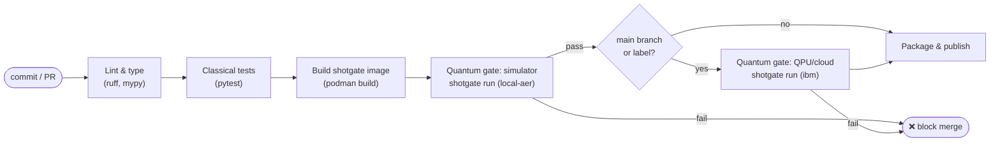
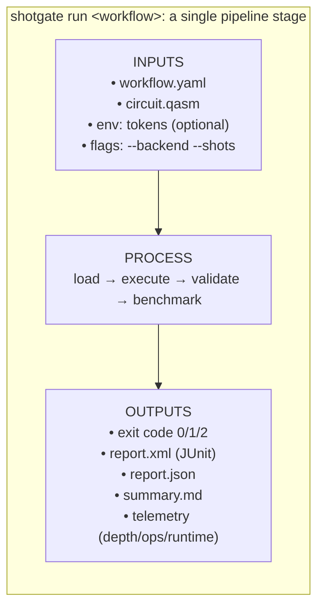
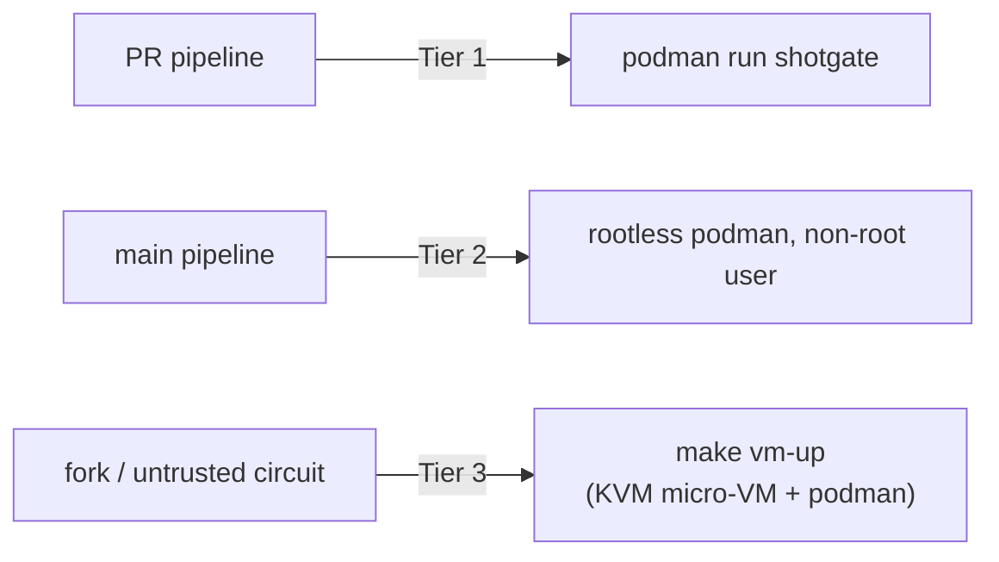

# Pipeline Schema

How shotgate slots into a CI/CD pipeline as a **quantum quality gate**, and the exact
contract it exposes to the pipeline (inputs, stages, outputs, exit codes).

## 1. The hybrid pipeline

A 2026-era quantum application is *hybrid*: classical code plus quantum kernels.
shotgate gates the quantum half with the same ergonomics as classical tests.



**Two-stage quantum gating** is the recommended pattern:

1. **Pre-merge / every PR → simulator.** Fast, free, deterministic with a seed. Runs
   the full assertion suite on `local-aer`. This is the gate that blocks merges.
2. **Post-merge / on-demand → real hardware.** Gated behind branch or label because
   QPU time is scarce and queued. Looser thresholds account for device noise.

## 2. Stage contract



| Exit code | Meaning | Pipeline effect |
| --- | --- | --- |
| `0` | All assertions in all jobs passed | Stage succeeds |
| `1` | At least one assertion failed (or a job errored) | Stage fails → block |
| `2` | Usage / workflow load error (bad YAML, missing file) | Stage fails → fix config |

| Output artifact | Flag | Consumer |
| --- | --- | --- |
| JUnit XML | `--junit report.xml` | CI test UIs (GitHub/GitLab/Jenkins), trend graphs |
| JSON | `--json report.json` | Dashboards, custom analytics, regression diffing |
| Markdown | `--markdown summary.md` | `$GITHUB_STEP_SUMMARY`, PR comments |
| Console | (default) | Local developer feedback (Rich tables) |

## 3. Reference CI configurations

The gate is **the same container on every platform**: pull
`ghcr.io/coldqubit/shotgate:latest`, run the workflow, emit a JUnit report, and let the
exit code fail the stage. The **exit-code contract (0 / 1 / 2) is identical across
GitHub Actions, GitLab CI, and Jenkins**: only the YAML/Groovy wrapper differs.

Ready-to-copy references live in the repo root:
[`.github/workflows/ci.yml`](../.github/workflows/ci.yml) ·
[`.gitlab-ci.yml`](../.gitlab-ci.yml) ·
[`Jenkinsfile`](../Jenkinsfile).

### GitHub Actions

```yaml
- name: Quantum quality gate (simulator)
  run: |
    podman run --rm --userns=keep-id --user "$(id -u):$(id -g)" \
      -v "$PWD:/work:Z" -w /work \
      ghcr.io/coldqubit/shotgate:latest \
      run examples/bell-state/workflow.yaml \
      --junit report.xml --markdown "$GITHUB_STEP_SUMMARY"
```

> shotgate's *own* repo CI ([`ci.yml`](../.github/workflows/ci.yml)) builds the image
> from source because it tests the source; **consumers pull the published image** as
> above.

### GitLab CI

```yaml
quantum-gate:
  image: ghcr.io/coldqubit/shotgate:latest
  script:
    - shotgate run examples/bell-state/workflow.yaml --junit report.xml
  artifacts:
    when: always
    reports:
      junit: report.xml      # a failed assertion turns the job red
```

### Jenkins (declarative)

```groovy
stage('Quantum gate') {
  steps {
    sh '''podman run --rm --userns=keep-id --user "$(id -u):$(id -g)" \
            -v "$PWD:/work:Z" -w /work ghcr.io/coldqubit/shotgate:latest \
            run examples/bell-state/workflow.yaml --junit report.xml'''
  }
  post { always { junit 'report.xml' } }   // surfaces per-assertion pass/fail
}
```

For the cloud/QPU path on any platform, swap in `:latest-ibm`, set
`SHOTGATE_IBM_TOKEN` (as a masked variable / credential), and target a noise-tolerant
workflow such as [`examples/bell-state-hardware`](../examples/bell-state-hardware/workflow.yaml).

## 4. Isolation escalation in the pipeline



Choose the tier per trigger: routine PRs use the plain container; runs of
externally-contributed circuits escalate to the QEMU micro-VM (see
[`infra/qemu`](../infra/qemu/README.md)).

## 5. Provisioning the gate with Terraform

When the pipeline itself is described as infrastructure, the
[Terraform module](../infra/terraform/README.md) turns "this workflow must pass" into
a planned, versioned resource:

```hcl
module "vqe_gate" {
  source   = "github.com/coldqubit/shotgate//infra/terraform"
  workflow = "workflows/vqe.yaml"
  backend  = "ibm"
  env      = { SHOTGATE_IBM_TOKEN = var.ibm_token }
}
```

`terraform apply` runs the gate; a failed assertion fails the apply (toggle with
`fail_on_assertion_error`).
